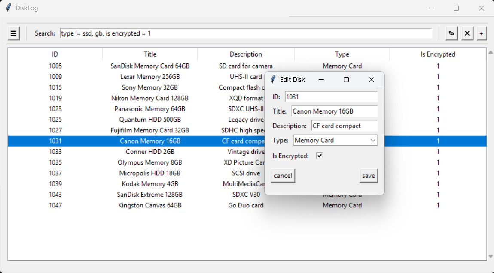

# DiskLog

**Stop guessing what's on your external drives.** DiskLog is a lightweight, fully customizable desktop application designed to track and manage collections of external disks, flash drives, and memory cards. Built entirely with Python's standard library, it offers a snappy, zero-dependency solution to digital hoarding.

What makes DiskLog special? **It is 100% config-driven.** You define your database schema and UI forms in a simple JSON file, and DiskLog automatically handles the rest, from rendering input fields to dynamically altering your SQLite database.

-----

-----
## ✨ Features

  * **🛠 Dynamic, Config-Driven UI:** Add, remove, or modify columns via a simple `config.json`. The app instantly generates the appropriate UI elements (text entries, dropdowns, checkboxes) and updates the database schema automatically.
  * **🔍 Advanced Query Search:** Don't just search for keywords; use powerful database operators directly in the search bar (e.g., `Type = SSD`, `is encrypted = 1`).
  * **✏️ In-App Schema Editor:** Tweak your `config.json` directly inside the app with built-in validation and syntax checking.
  * **🛡️ Smart Data Validation:** Enforce required fields, unique values, and Regex patterns directly from your configuration.
  * **⚡ Zero Dependencies:** Built strictly with Python's standard library (`tkinter`, `sqlite3`, `json`). No `pip install` required.

-----

## 🚀 Getting Started

### 📦 Portable Version (Windows)
For the quickest experience, download the latest `.exe` from the **Releases** page.
* **No Installation Required:** Just double-click the executable to run the app instantly.
* **Self-Contained:** Everything needed to run DiskLog is packed into a single file.

### 🐍 Running from Source
**Requirements:**
* **Python 3.10** or higher.
* Windows, macOS, or Linux (requires an environment capable of running Tkinter).

**Installation & Execution:**
1. Clone the repository:
   ```bash
   git clone https://github.com/MohtadiAwada/DiskLog.git
   cd DiskLog
   ```

2. Run the application:
   ```bash
   python app.py
   ```

*(Upon first launch, DiskLog will automatically generate the default `data.db` and `config.json` files for you.)*

-----

## 📖 How to Use Properly (The "Special Features")

DiskLog looks simple on the surface, but it hides a highly flexible backend. Here is how to unlock its full potential:

### 1\. The Magic of `config.json`

Everything in DiskLog is dictated by your configuration. You can edit this file via a text editor or by clicking the **"☰" (Menu)** button in the app.

When you add a new dictionary to the `columns` list, **DiskLog's DB engine will automatically execute an `ALTER TABLE` command to update your SQLite database.** No SQL knowledge needed\!

**Supported Input Types:**

  * `entry`: Standard text input.
  * `select`: Dropdown menu (requires a `values` array).
  * `checkbox`: Boolean toggle (saves as `0` or `1` in SQLite).

**Advanced Column Constraints:**
You can add these keys to any column to strictly control what data goes into your database:

  * `"required": true` — Prevents saving if left blank.
  * `"unique": true` — Prevents saving if the value already exists in the database.
  * `"pattern": "^\\d{4}$"` — Uses Regex to validate input (e.g., forcing exactly 4 digits).

### 2\. Advanced Search Syntax

The search bar isn't just a basic text filter. It parses your input to execute complex SQL queries behind the scenes.

  * **Global Search:** Type any word (e.g., `Backup`), and DiskLog will search across *all* columns.
  * **Targeted Operators:** Use specific operators (`=`, `!=`, `>`, `<`, `>=`, `<=`, `LIKE`) to target specific columns.
      * *Example:* `Type != HDD`
      * *Example:* `Is Encrypted = 1`
  * **Multiple Queries:** Separate queries with a comma to combine filters.
      * *Example:* `Type = Flash Drive, Sandisk` (Finds flash drives that have the word "Sandisk" anywhere in their data).

-----

## 🏗️ Project Architecture

DiskLog v2 was fully rewritten to decouple the UI from the database logic, making it highly maintainable.

```text
DiskLog/
├── app.py                 # Entry point (Initializes Tkinter mainloop)
├── config.json            # Auto-generated schema configuration
├── data.db                # Auto-generated SQLite database
├── core/                  # Backend Logic
│   ├── config.py          # Config loader, parser, and validator
│   ├── db.py              # Dynamic SQLite engine and query parser
│   └── store.py           # State management connecting DB, Config, and UI
├── models/                # Reusable UI Components
│   ├── table.py           # Dynamic ttk.Treeview data grid
│   └── tools.py           # Toolbar buttons and tooltips
└── windows/               # Application Windows
    ├── main.py            # Main GUI layout
    ├── add_popup.py       # Dynamic form for new entries
    ├── edit_popup.py      # Dynamic form for editing existing entries
    └── config_popup.py    # Raw JSON editor with safety validations
```

-----

## 🔄 Migrating from v1

DiskLog v2 is a massive architectural leap from v1 (which utilized JSON for data storage and `CustomTkinter`).

Because v2 relies on a robust SQLite backend and a dynamic typing engine, **it is not backwards compatible with v1's `data.json`.** Your v1 data will not be automatically imported.

If you wish to continue using v1, the legacy source code and releases are still available on the `main` branch under the [v1.2.0 release](../../releases).

-----

## 📄 License

This project is licensed under the MIT License - see the [LICENSE](./LICENSE) file for details.